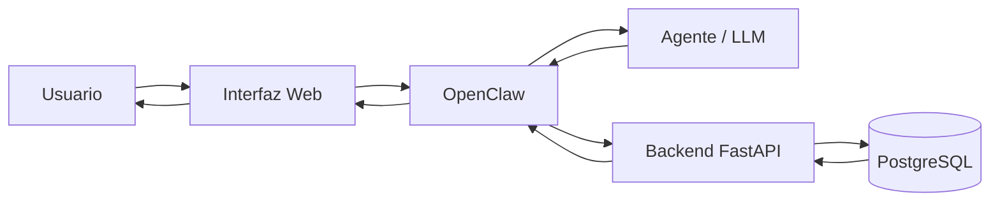

# Arquitectura del proyecto

## Objetivo

La Plataforma Conversacional de Finanzas Personales utilizara una arquitectura modular con separacion de responsabilidades.

La interpretacion del lenguaje natural estara separada de las reglas de negocio y de la persistencia de datos.

El principio central de la arquitectura es:

> El agente interpreta. El backend decide.

El agente podra interpretar lo solicitado por el usuario, pero las operaciones financieras seran validadas y ejecutadas por el backend.

---

## Arquitectura general

El flujo principal del sistema sera:

`Usuario → Interfaz Web → OpenClaw → Agente/LLM → Backend FastAPI → PostgreSQL → Respuesta`



---

## Componentes principales

### Interfaz Web

Sera el punto de acceso del usuario al sistema.

Permitira autenticarse, interactuar mediante lenguaje natural y consultar la informacion financiera.

**Tecnologia:** React.

### OpenClaw

Funcionara como capa de orquestacion entre la interfaz, el modelo de lenguaje y el backend.

Coordinara la interpretacion de los mensajes y la ejecucion de las herramientas disponibles.

No tendra acceso directo a la base de datos ni implementara las reglas financieras.

### Agente / LLM

Interpretara las solicitudes realizadas en lenguaje natural y las transformara en solicitudes estructuradas.

Si falta informacion necesaria para ejecutar una operacion, debera solicitar una aclaracion en lugar de inventar datos.

### Backend

Sera responsable de las reglas de negocio y expondra una API REST mediante FastAPI.

Validara autenticacion, autorizacion, cuentas, categorias, importes y operaciones financieras antes de realizar modificaciones.

### Base de datos

PostgreSQL sera la fuente de verdad del sistema.

Almacenara usuarios, cuentas, categorias y transacciones. El acceso a la base de datos se realizara exclusivamente desde el backend.

---

## Arquitectura interna del backend

El backend se organizara en capas con responsabilidades separadas:

```text
backend/
├── app/
│   ├── main.py
│   ├── database.py
│   ├── security.py
│   ├── models/
│   ├── schemas/
│   └── routers/
├── alembic/
└── requirements.txt
```

- `routers`: endpoints de la API.
- `schemas`: estructuras de entrada y salida y validacion de datos.
- `models`: entidades persistidas en la base de datos.
- `security`: autenticacion, tokens y manejo de contraseñas.
- `database`: configuracion del acceso a PostgreSQL.
- `alembic`: versionado del esquema de la base de datos.

El detalle de las operaciones disponibles para la comunicacion entre el agente y el backend se encuentra documentado en `docs/tools.md`.

---

## Tecnologias

| Componente | Tecnologia |
|---|---|
| Frontend | React |
| Orquestacion | OpenClaw |
| Procesamiento conversacional | LLM mediante API |
| Backend | Python + FastAPI |
| Validacion | Pydantic |
| ORM | SQLAlchemy |
| Base de datos | PostgreSQL |
| Migraciones | Alembic |
| Autenticacion | JWT |
| Testing | pytest |
| Control de versiones | Git + GitHub |
| Contenedores | Docker |

El proveedor del modelo de lenguaje y el servicio de despliegue se definiran durante la etapa de implementacion.

---

## Justificacion tecnica

**FastAPI** permite desarrollar una API REST en Python con validacion de datos y una estructura simple para separar las distintas responsabilidades del backend.

**PostgreSQL** fue seleccionado porque el dominio presenta entidades relacionadas y requiere mantener integridad entre usuarios, cuentas, categorias y movimientos.

**SQLAlchemy** se utilizara para mapear las entidades del dominio y gestionar la persistencia, mientras que **Alembic** permitira versionar los cambios del esquema.

**React** permitira desarrollar una interfaz web basada en componentes.

**OpenClaw** se utilizara como capa de orquestacion, manteniendo separada la interpretacion conversacional de las reglas financieras.

El **LLM** se utilizara para interpretar lenguaje natural, pero no tendra control directo sobre los datos ni reemplazara las validaciones del backend.

---

## Seguridad

La arquitectura contempla:

- Contraseñas almacenadas mediante hash.
- Autenticacion mediante tokens.
- Autorizacion de las operaciones por usuario.
- Separacion de los datos de distintos usuarios.
- Variables sensibles almacenadas fuera del codigo.
- Acceso a PostgreSQL exclusivamente desde el backend.
- Ausencia de acceso directo del agente a la base de datos.

La identidad del usuario sera determinada por el mecanismo de autenticacion y no por informacion generada por el modelo de lenguaje.

---

## Criterio de diseño

La separacion de responsabilidades permite que cada componente tenga una funcion definida:

- El agente interpreta.
- OpenClaw coordina.
- El backend valida y ejecuta.
- PostgreSQL conserva el estado.
- La interfaz presenta el resultado.

De esta manera, la capa conversacional puede evolucionar sin modificar las reglas centrales del sistema y el backend puede probarse independientemente del modelo de lenguaje.