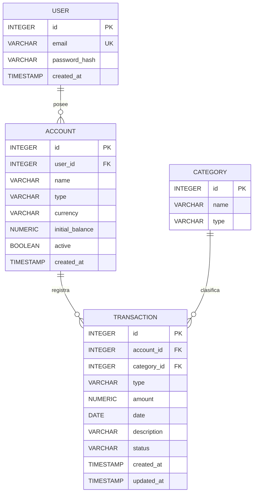

# Modelo de datos

## Objetivo

El modelo de datos del P0 busca representar las entidades minimas necesarias para registrar y consultar movimientos financieros personales.

Se prioriza un modelo simple que permita implementar y validar primero el nucleo funcional del sistema, evitando incorporar en esta etapa funcionalidades que aumenten innecesariamente la complejidad.

El P0 trabajara exclusivamente con pesos argentinos (ARS) y con cuentas simples de disponibilidad.

---

## Entidades

### User

Representa a cada usuario registrado en la aplicacion.

Campos principales:

- `id`: identificador unico.
- `email`: correo electronico utilizado para identificar al usuario.
- `password_hash`: contraseña almacenada de forma segura mediante hash.
- `created_at`: fecha y hora de creacion.

Cada usuario puede tener multiples cuentas.

### Account

Representa una cuenta desde la cual el usuario registra ingresos y gastos.

Campos principales:

- `id`: identificador unico.
- `user_id`: usuario propietario de la cuenta.
- `name`: nombre asignado a la cuenta.
- `type`: tipo de cuenta.
- `currency`: moneda de la cuenta.
- `initial_balance`: saldo inicial informado por el usuario.
- `active`: indica si la cuenta se encuentra activa.
- `created_at`: fecha y hora de creacion.

Los tipos de cuenta contemplados inicialmente son:

- `CASH`: efectivo.
- `BANK`: cuenta bancaria.
- `WALLET`: billetera virtual.

Ejemplos:

- Efectivo.
- Banco Nacion.
- Mercado Pago.

Durante el P0 todas las cuentas utilizaran `ARS`.

No se contemplan inicialmente tarjetas de credito, inversiones ni cuentas en otras monedas.

### Category

Representa la clasificacion de un ingreso o gasto.

Campos principales:

- `id`: identificador unico.
- `name`: nombre de la categoria.
- `type`: indica si corresponde a un ingreso o gasto.

Los valores posibles para `type` son:

- `EXPENSE`
- `INCOME`

En el P0 las categorias seran predefinidas por el sistema.

Ejemplos de categorias de gastos:

- Alimentacion.
- Transporte.
- Vivienda.
- Servicios.
- Salud.
- Educacion.
- Entretenimiento.
- Compras.
- Otros.

Ejemplos de categorias de ingresos:

- Sueldo.
- Honorarios.
- Inversiones.
- Otros.

La creacion de categorias personalizadas por parte del usuario queda fuera del alcance del P0 y podra evaluarse como funcionalidad posterior.

### Transaction

Representa un movimiento financiero registrado en una cuenta.

Campos principales:

- `id`: identificador unico.
- `account_id`: cuenta asociada.
- `category_id`: categoria asociada.
- `type`: tipo de movimiento.
- `amount`: importe.
- `date`: fecha del movimiento.
- `description`: descripcion opcional del movimiento.
- `status`: estado del movimiento.
- `created_at`: fecha y hora de creacion.
- `updated_at`: fecha y hora de ultima modificacion.

Los tipos de movimiento contemplados en P0 son:

- `EXPENSE`
- `INCOME`

Los estados iniciales son:

- `ACTIVE`
- `VOIDED`

Los movimientos no se eliminaran fisicamente como mecanismo habitual de correccion. Una operacion anulada conservara su registro y cambiara su estado a `VOIDED`, permitiendo mantener la trazabilidad.

---

## Esquema relacional

### users

| Campo | Tipo de dato | Restricciones |
|---|---|---|
| `id` | INTEGER | PK |
| `email` | VARCHAR(255) | NOT NULL, UNIQUE |
| `password_hash` | VARCHAR(255) | NOT NULL |
| `created_at` | TIMESTAMP | NOT NULL |

### accounts

| Campo | Tipo de dato | Restricciones |
|---|---|---|
| `id` | INTEGER | PK |
| `user_id` | INTEGER | FK → `users.id`, NOT NULL |
| `name` | VARCHAR(100) | NOT NULL |
| `type` | VARCHAR(20) | NOT NULL |
| `currency` | VARCHAR(3) | NOT NULL |
| `initial_balance` | NUMERIC(15,2) | NOT NULL |
| `active` | BOOLEAN | NOT NULL |
| `created_at` | TIMESTAMP | NOT NULL |

### categories

| Campo | Tipo de dato | Restricciones |
|---|---|---|
| `id` | INTEGER | PK |
| `name` | VARCHAR(100) | NOT NULL |
| `type` | VARCHAR(20) | NOT NULL |

### transactions

| Campo | Tipo de dato | Restricciones |
|---|---|---|
| `id` | INTEGER | PK |
| `account_id` | INTEGER | FK → `accounts.id`, NOT NULL |
| `category_id` | INTEGER | FK → `categories.id`, NOT NULL |
| `type` | VARCHAR(20) | NOT NULL |
| `amount` | NUMERIC(15,2) | NOT NULL |
| `date` | DATE | NOT NULL |
| `description` | VARCHAR(255) | NULL |
| `status` | VARCHAR(20) | NOT NULL |
| `created_at` | TIMESTAMP | NOT NULL |
| `updated_at` | TIMESTAMP | NOT NULL |

---

## Relaciones

Las relaciones principales son:

- Un `User` puede tener muchas `Account`.
- Cada `Account` pertenece a un unico `User`.
- Una `Account` puede tener muchas `Transaction`.
- Cada `Transaction` pertenece a una unica `Account`.
- Una `Category` puede estar asociada a muchas `Transaction`.
- Cada `Transaction` pertenece a una unica `Category`.

La relacion entre `User` y `Transaction` es indirecta a traves de `Account`. De esta forma se evita almacenar de manera redundante el usuario en cada movimiento y se mantiene una unica fuente para determinar la propiedad de una transaccion.

---

## Diagrama entidad-relacion

---

## Indices principales

Para facilitar las consultas mas frecuentes se contemplan los siguientes indices:

- `users.email`: indice unico para identificar usuarios y evitar emails duplicados.
- `accounts.user_id`: facilita la busqueda de las cuentas pertenecientes a un usuario.
- `transactions.account_id`: facilita la consulta de movimientos correspondientes a una cuenta.
- `transactions.category_id`: facilita consultas y agrupaciones de movimientos por categoria.
- `transactions.date`: facilita la consulta de movimientos dentro de un periodo determinado.

Los indices definidos en esta etapa podran ajustarse posteriormente de acuerdo con las consultas reales y las necesidades de rendimiento observadas durante el desarrollo.

---

## Decisiones de diseño

### Separacion entre usuario y transaccion

`Transaction` no almacena directamente un `user_id`.

La propiedad del movimiento se determina mediante la relacion:

`Transaction → Account → User`

Esto evita duplicar informacion y reduce el riesgo de inconsistencias entre el usuario asociado a una cuenta y el usuario asociado a un movimiento.

### Saldo de las cuentas

El saldo actual no se almacena como un campo independiente.

Se obtiene a partir de:

`saldo inicial + ingresos activos - gastos activos`

De esta forma los movimientos financieros constituyen la fuente de informacion utilizada para determinar el saldo.

### Categorias

Durante el P0 las categorias son globales y predefinidas por el sistema.

En una etapa posterior se podra extender el modelo incorporando categorias personalizadas asociadas a cada usuario.

### Alcance inicial

El modelo P0 contempla exclusivamente:

- Usuarios.
- Cuentas de efectivo, bancarias y billeteras virtuales.
- Ingresos.
- Gastos.
- Categorias predefinidas.
- Moneda ARS.
- Anulacion logica de movimientos.

Quedan fuera del alcance inicial:

- Tarjetas de credito.
- Multiples monedas.
- Transferencias entre cuentas.
- Movimientos recurrentes.
- Presupuestos.
- Categorias personalizadas.
- Integraciones directas con bancos o billeteras.