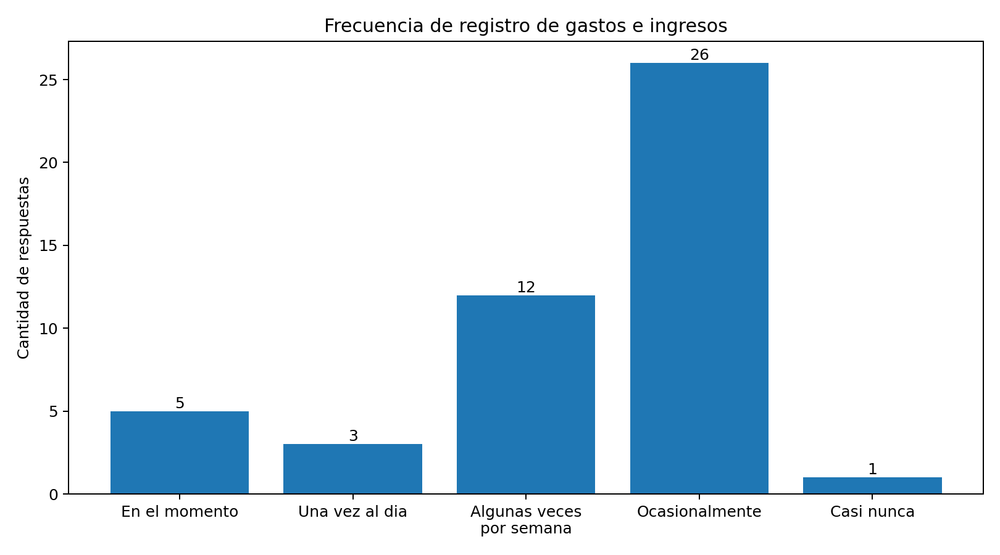
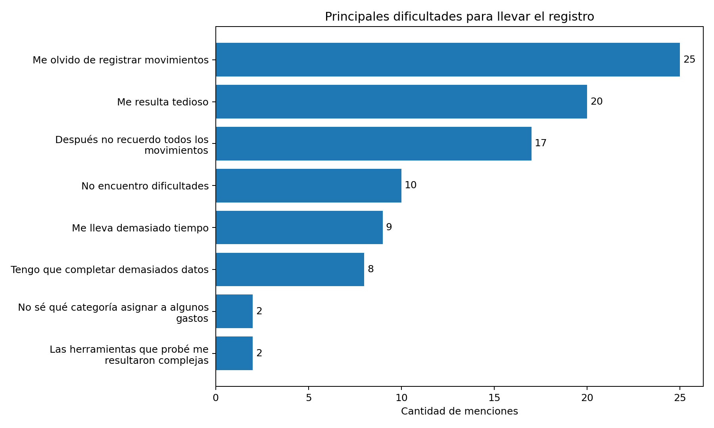
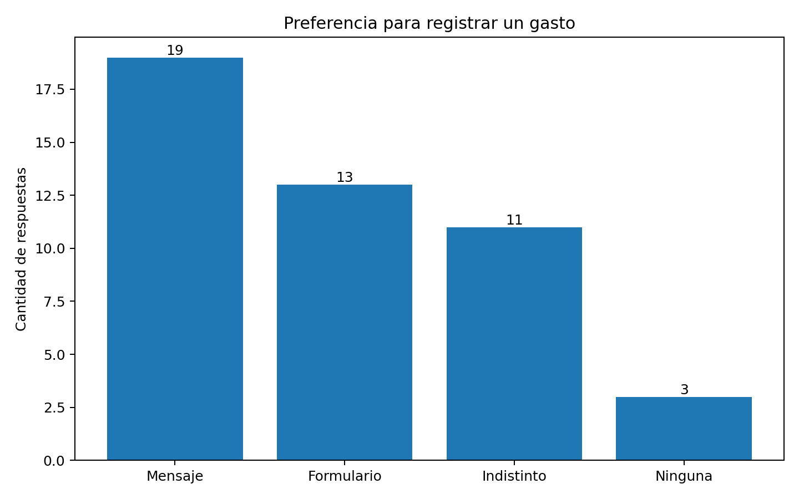
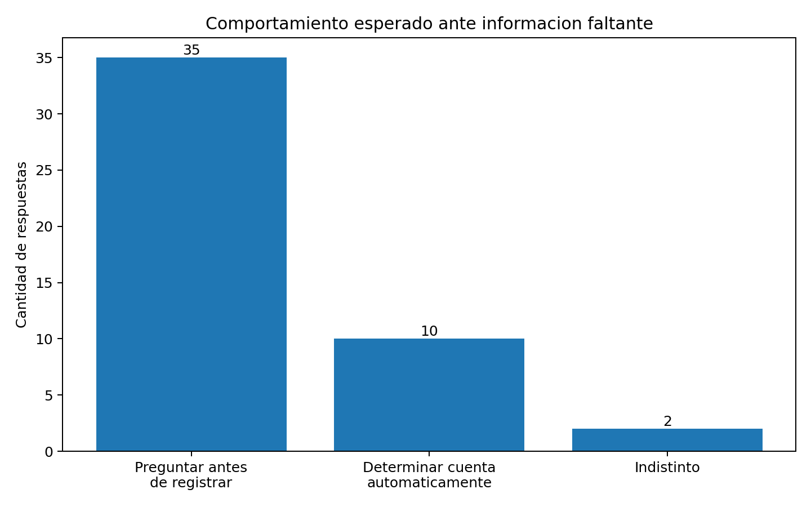

# Validacion con usuarios

## Objetivo

Como parte de la definicion del proyecto se realizo una encuesta con el objetivo de conocer como las personas registran actualmente sus gastos e ingresos, que dificultades encuentran en ese proceso y que nivel de interes existe en una alternativa basada en lenguaje natural.

La validacion busco principalmente analizar la hipotesis planteada en el proyecto: que el registro manual de movimientos financieros puede generar friccion, provocando registros incompletos, irregulares o directamente el abandono del seguimiento de las finanzas personales.

Tambien se consulto sobre la posibilidad de utilizar una interfaz conversacional para registrar y consultar movimientos, el comportamiento esperado ante informacion faltante y las principales preocupaciones relacionadas con el uso de este tipo de aplicacion.

## Metodologia

Se realizo una encuesta a **47 personas**, incluyendo participantes de diferentes edades y ocupaciones.

La encuesta incluyo preguntas relacionadas con:

- forma actual de registrar gastos e ingresos;
- frecuencia de registro;
- dificultades encontradas durante el registro;
- cantidad de cuentas o billeteras utilizadas;
- preferencia entre formulario tradicional e ingreso mediante lenguaje natural;
- comportamiento esperado cuando falta informacion para registrar una operacion;
- consultas financieras que resultarian utiles;
- preocupaciones relacionadas con privacidad, seguridad e inteligencia artificial;
- intencion de utilizar una aplicacion con estas caracteristicas.

## Resultados

### Registro actual de gastos e ingresos

De las 47 personas encuestadas:

- **35 personas (74,5%)** indicaron que llevan algun tipo de registro de sus gastos e ingresos.
- Solo **10 personas (21,3%)** manifestaron realizar ese registro de manera regular.
- **26 personas (55,3%)** indicaron que registran sus movimientos solo ocasionalmente.

Estos resultados muestran que, aunque existe interes por controlar las finanzas personales, mantener el registro de manera constante presenta dificultades.

### Principales dificultades

Entre las dificultades mencionadas con mayor frecuencia se encontraron:

- **25 personas (53,2%)** indicaron que se olvidan de registrar algunos movimientos.
- **20 personas (42,6%)** consideran que el proceso de registro resulta tedioso.
- **17 personas (36,2%)** indicaron que posteriormente no recuerdan todos los movimientos realizados.

Los resultados respaldan la existencia de friccion en el proceso de registro, especialmente relacionada con el tiempo transcurrido entre la realizacion de un gasto y su posterior carga.

### Uso de multiples cuentas

**43 de las 47 personas (91,5%)** indicaron utilizar mas de una cuenta, banco, billetera virtual o medio similar para manejar su dinero.

Este resultado refuerza la necesidad de que la aplicacion permita administrar diferentes cuentas y asociar cada movimiento con la cuenta correspondiente.

### Formulario tradicional vs. lenguaje natural

Se planteo un ejemplo concreto de registro de un gasto y se consulto si resultaria mas comodo completar un formulario tradicional o escribir directamente un mensaje.

De las 46 personas que respondieron esta pregunta:

- **19 personas (41,3%)** prefirieron escribir un mensaje.
- **13 personas (28,3%)** prefirieron utilizar un formulario.
- **11 personas (23,9%)** indicaron que cualquiera de las dos alternativas les resultaria indistinta.
- **3 personas (6,5%)** indicaron que no utilizarian ninguna de las dos opciones.

Los resultados no muestran un reemplazo absoluto del formulario tradicional, pero si un interes significativo por utilizar lenguaje natural como alternativa para registrar movimientos.

Por este motivo se considera conveniente mantener la posibilidad de utilizar ambos mecanismos, utilizando el mismo backend y las mismas reglas de negocio.

### Informacion faltante y ambiguedad

Se consulto que comportamiento esperarian los usuarios ante una expresion como:

> "Gaste $20.000 ayer"

cuando falta informacion necesaria, por ejemplo la cuenta desde la cual se realizo el gasto.

**35 de las 47 personas (74,5%)** indicaron que preferirian que la aplicacion pregunte antes de registrar el movimiento.

Este resultado respalda una de las reglas principales definidas para el sistema:

> Ante informacion relevante faltante o ambigua, el sistema debe solicitar una aclaracion antes de ejecutar la operacion.

El objetivo sera priorizar la seguridad de la operacion por sobre la automatizacion completa, evitando registrar silenciosamente informacion que pueda haber sido interpretada incorrectamente.

### Intencion de uso

Ante la pregunta sobre si utilizarian una aplicacion que permita registrar y consultar gastos e ingresos mediante lenguaje natural:

- **36 de las 47 personas (76,6%)** respondieron que seguramente o probablemente la utilizarian.

Tambien se observo una menor intencion de uso dentro del grupo de participantes de 60 años o mas, lo que indica que la aceptacion de una interfaz conversacional puede variar segun el perfil del usuario.

### Privacidad y seguridad

Las principales preocupaciones mencionadas fueron:

- privacidad de los datos: **32 personas**;
- seguridad de la aplicacion: **24 personas**;
- acceso de terceros a la informacion: **17 personas**;
- desconocimiento sobre que informacion se envia a servicios de inteligencia artificial: **14 personas**.

Estos resultados muestran que la privacidad y la seguridad deben formar parte de los requisitos principales del sistema y no ser consideradas solamente aspectos secundarios de implementacion.

## Analisis de los resultados

Los resultados obtenidos respaldan la problematica planteada inicialmente.

Si bien una parte importante de los participantes intenta llevar algun tipo de control de sus finanzas personales, el registro no siempre se realiza de manera constante. El olvido, la carga tediosa y la dificultad para recordar posteriormente los movimientos aparecen como problemas frecuentes.

La utilizacion de lenguaje natural presenta un nivel de aceptacion suficiente para continuar evaluando la propuesta. Sin embargo, los resultados tambien muestran que el formulario tradicional sigue siendo una alternativa valorada por una parte de los usuarios.

Por este motivo, el objetivo del proyecto no sera eliminar necesariamente los mecanismos tradicionales de carga, sino evaluar si una interfaz conversacional puede ofrecer una forma adicional y mas agil de interactuar con el sistema.

## Decisiones tomadas a partir de la validacion

A partir de los resultados obtenidos se definieron las siguientes decisiones para el P0 del proyecto:

- permitir el registro de gastos e ingresos mediante lenguaje natural;
- mantener la posibilidad de incorporar una carga tradicional mediante formulario;
- permitir que cada usuario administre multiples cuentas;
- limitar inicialmente las cuentas a efectivo, cuentas bancarias y billeteras virtuales;
- utilizar ARS como unica moneda durante el P0;
- solicitar aclaraciones cuando falte informacion necesaria para ejecutar una operacion;
- evitar que el modelo de lenguaje ejecute directamente operaciones sobre los datos;
- mantener las validaciones y reglas de negocio dentro del backend;
- permitir la correccion o anulacion de movimientos manteniendo su trazabilidad;
- minimizar la informacion enviada al proveedor de inteligencia artificial;
- contemplar desde el diseño la separacion de datos entre usuarios y la proteccion de informacion financiera.

## Conclusion

La encuesta permitio obtener evidencia inicial sobre la existencia del problema que busca abordar el proyecto y sobre la aceptacion de una interfaz conversacional como mecanismo complementario para registrar y consultar informacion financiera.

Los resultados tambien permitieron identificar requisitos que afectan directamente al diseño del sistema, principalmente el manejo de multiples cuentas, la necesidad de solicitar aclaraciones ante informacion incompleta y la importancia de la privacidad y seguridad.

A partir de esta validacion se considera adecuado avanzar con la implementacion del P0 y posteriormente evaluar el funcionamiento de la interfaz conversacional mediante casos de prueba previamente definidos.
